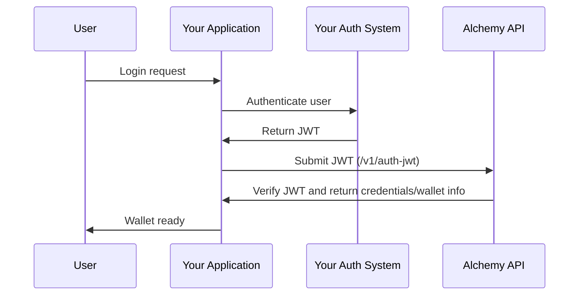

Integrate your existing authentication provider and add smart wallet functionality to your app without changing your users' login experience. We support JWT-based and OIDC-compliant authentication providers.

## Prerequisites

Before implementing JWT authentication, verify that your authentication system meets these requirements:

### 1. OIDC Compliance

Your authentication system must be [**OpenID Connect (OIDC) compliant**](https://auth0.com/docs/authenticate/protocols/openid-connect-protocol#openid-and-jwts) and capable of issuing **JWT tokens**.

### 2. Required Endpoints

#### OpenID Connect Discovery Endpoint

Host a discovery endpoint at: `<YOUR_API_DOMAIN>/.well-known/openid-configuration`

The response must include these required fields from the [**OpenID spec**](https://openid.net/specs/openid-connect-discovery-1_0.html#ProviderMetadata):

```json
{
  "issuer": "<YOUR_API_DOMAIN>",
  "jwks_uri": "<YOUR_JWKS_ENDPOINT_URL>",
  "id_token_signing_alg_values_supported": ["RS256"],
  "authorization_endpoint": "<YOUR_AUTH_ENDPOINT>",
  "response_types_supported": ["<YOUR_SUPPORTED_RESPONSE_TYPE>"],
  "subject_types_supported": ["<YOUR_SUPPORTED_SUBJECT_TYPE>"]
}
```

**Field explanations:**

- `issuer`: Your API domain (must match the `iss` claim in your JWTs)
- `jwks_uri`: Endpoint URL where Alchemy can retrieve the JWT public key for verification
- `id_token_signing_alg_values_supported`: Must include "RS256" algorithm

### 3. JWT Structure Requirements

#### JWT Header Requirements

Your JWT header must include:

| Field | Description                                            | Example   |
| ----- | ------------------------------------------------------ | --------- |
| `alg` | Algorithm used to sign the JWT                         | `"RS256"` |
| `typ` | Token type                                             | `"JWT"`   |
| `kid` | Key ID that matches the `kid` field from your JWKs URI | `"key-1"` |

**Important**: The `kid` field in the JWT header must correspond to a key identifier from your JWKS endpoint to enable proper key lookup during token verification.

#### JWT Payload Requirements

Your JWTs must contain these claims:

| Claim   | Description                              | Example                                                 |
| ------- | ---------------------------------------- | ------------------------------------------------------- |
| `iss`   | Issuer - your auth provider's API domain | `"https://auth.example.com"`                            |
| `sub`   | Subject - unique user identifier         | `"user123"` or `"550e8400-e29b-41d4-a716-446655440000"` |
| `aud`   | Audience - client ID issued by Alchemy   | `"your-alchemy-audience-id"`                            |
| `nonce` | Target public key hash (see below)       | `"a1b2c3d4..."`                                         |

**Important**: The `nonce` claim must be `toHex(sha256(targetPublicKey))` **without** the leading `0x`.

<Note>
  You can generate the `targetPublicKey` from the [Alchemy Signer
  SDK](/wallets/reference/account-kit/signer/classes/AlchemySignerWebClient/targetPublicKey)
</Note>

<Tip>
  If your OAuth provider reserves the `nonce` claim, you can use `tknonce` as an
  alternative. Only one of `nonce` or `tknonce` needs to be set.
</Tip>

<Warning>
  The combination of (`iss`, `sub`, `aud`) acts as a unique user identifier.
  Ensure these values are consistent for each user.
</Warning>

### 4. Audience Claim

The `aud` claim must be set to your Alchemy-provided audience ID. You can obtain the audience claim from your Smart Wallet configuration in the [Alchemy Dashboard](https://dashboard.alchemy.com/accounts/config/create).


## Implementation Guide

<Tabs>
  <Tab title="React">
    ## Using React Hooks

    ### Step 1: Install Dependencies

    ```bash
    npm install @account-kit/signer @account-kit/react
    ```

    ### Step 2: Generate Target Public Key

    Before creating your JWT, generate the required `targetPublicKey`:

    ```tsx twoslash
    import { AlchemySignerWebClient } from "@account-kit/signer";

    const client = new AlchemySignerWebClient({
      connection: {
        apiKey: "your-api-key",
      },
      iframeConfig: {
        iframeContainerId: "signer-iframe-container",
      },
    });

    // Generate the target public key
    const targetPublicKey = await client.targetPublicKey();

    // Use this in your JWT's nonce claim
    // nonce = toHex(sha256(targetPublicKey)) without the '0x'
    ```

    ### Step 3: Create and Submit JWT

    After generating your JWT with the proper claims, authenticate the user:

    ```tsx twoslash
    import { useAuthenticate } from "@account-kit/react";

    // Inside your component
    const { authenticate, isPending } = useAuthenticate();

    const handleJwtAuth = async (jwt: string) => {
      try {
        await authenticate({
          type: "custom-jwt",
          jwt // Your generated JWT with required claims
        });
      } catch (error) {
        console.error("Authentication failed:", error);
      }
    };
    ```

    ### Step 4: Check Authentication Status

    Monitor authentication status and handle the connected user:

    ```tsx twoslash
    import { useSignerStatus, useUser } from "@account-kit/react";

    const MyComponent = () => {
      const { isConnected } = useSignerStatus();
      const user = useUser();

      if (isConnected && user) {
        return (
          <div>
            <p>Welcome, {user.email}!</p>
            <p>Wallet Address: {user.address}</p>
          </div>
        );
      }

      return <div>Not authenticated</div>;
    };
    ```

  </Tab>
  
  <Tab title="APIs">
    ## Authenticating Users with a JWT token

    **Endpoint:** `POST https://api.g.alchemy.com/signer/v1/auth-jwt`

    **Request Body:**
    ```json
    {
      "jwt": "eyJhbGciOiJSUzI1NiJ9...", // Your base64 encoded JWT
      "targetPublicKey": "0x1234...",
    }
    ```

    **Success Response:**
    ```json
    {
      "isSignup": false,
      "credentialBundle": "encrypted-credential-bundle",
      "orgId": "organization-id"
    }
    ```

    ## Pre-generating Embedded Wallet Addresses using JWT token

    **Endpoint:** `POST https://api.g.alchemy.com/signer/v1/auth-jwt`

    To pre-generate wallet addresses before user authentication, omit the `targetPublicKey`:

    **Request Body:**
    ```json
    {
      "jwt": "eyJhbGciOiJSUzI1NiJ9...",
    }
    ```

    **Pre-generation Response:**
    ```json
    {
      "isSignup": true,
      "userId": "alchemy-user-id",
      "address": "0xabcdef...", // EOA signer address
      "solanaAddress": "5Gv7...", // Solana address (if applicable)
      "orgId": "organization-id"
    }
    ```

    <Info>
    The `address` returned is the EOA signer address. To get the actual smart contract wallet address, call the `getAddress()` method on your smart account implementation using this signer address.
    </Info>

  </Tab>
</Tabs>

## Architecture Overview

The JWT authentication flow works as follows:

1. **User Authentication**: User logs into your existing auth system
2. **JWT Generation**: Your backend generates a JWT with required claims
3. **Submit to Alchemy**: Frontend submits JWT to Alchemy's auth endpoint
4. **Verification**: Alchemy verifies JWT using your JWKS endpoint
5. **Wallet Access**: User gains access to their smart wallet



## Testing and Validation

### JWT Validation Tool

Use [jwt.io](https://jwt.io/) to decode and validate your JWT structure before integration.

### Required Claims Checklist

- `iss` matches your OpenID config issuer
- `sub` contains unique user identifier
- `aud` contains your Alchemy-provided audience ID
- `nonce` or `tknonce` contains `toHex(sha256(targetPublicKey))` without `0x`
- JWT is signed with RS256 algorithm

### Integration Testing

1. Verify your `.well-known/openid-configuration` endpoint is accessible
2. Test JWKS endpoint returns valid public keys
3. Validate JWT signature verification works
4. Test complete authentication flow with sample users

## Next Steps

### Sending a User Operation

Once your users have been authenticated, you can start [sending user operations](/wallets/transactions/send/send-user-operations).

### Sponsor Gas for a User Operation

Start [sponsoring gas fees](/wallets/transactions/sponsor-gas/sponsor-gas) for transactions via the Gas Manager.
