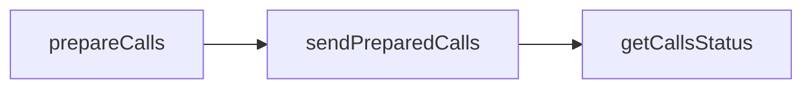

This short guide will introduce how to prepare and send user operations using a 7702 account in a matter of minutes. We'll demonstrate how to do it [using the SDK client](#using-the-typescript-sdk) or by using platform-agnostic [JSON-RPC APIs](#using-the-json-rpc-apis-directly).

The logical flow is to prepare the calls you're looking to send, sign them, and send them!

In API calls, it's as simple as:



This guide assumes you have an account you can sign with, like an [Alchemy Signer](https://www.alchemy.com/docs/wallets/signer/what-is-a-signer#alchemy-signer) or a user's EOA. You will also need an Alchemy API key, and a [gas manager policy ID](https://www.alchemy.com/docs/wallets/react/sponsor-gas) if you want to sponsor gas.

<Tip title="Don't have an API key?" icon="star">
  Start using the Alchemy Wallets API today! [Get started for
  free](https://dashboard.alchemy.com/signup/?a=f8afc2202c).
</Tip>

## Using The TypeScript SDK

### 1. Install Prerequisites

You're going to need the `@account-kit/wallet-client` and `@account-kit/infra`. We'll also be using `LocalAccountSigner` from `@aa-sdk/core` as the signer for demonstration purposes.

<CodeGroup>
```shell npm
npm install @account-kit/wallet-client @account-kit/infra @aa-sdk/core
```

```shell bun
bun add @account-kit/wallet-client @account-kit/infra @aa-sdk/core
```

```shell yarn
yarn add @account-kit/wallet-client @account-kit/infra @aa-sdk/core
```

```shell pnpm
pnpm install @account-kit/wallet-client @account-kit/infra @aa-sdk/core
```

</CodeGroup>

### 2. Create A Smart Wallet Client

Create a client for a given signer (e.g. a `LocalAccountSigner` imported from `@aa-sdk/core` or an [Alchemy Signer](https://www.alchemy.com/docs/wallets/signer/what-is-a-signer#alchemy-signer)).

```ts
import { createSmartWalletClient } from "@account-kit/wallet-client";
import { alchemy, arbitrumSepolia } from "@account-kit/infra";
import { LocalAccountSigner } from "@aa-sdk/core";

const signer = LocalAccountSigner.privateKeyToAccountSigner(PRIVATE_KEY); // we use a private key signer as an example here

const transport = alchemy({
  apiKey: ALCHEMY_API_KEY, // use your Alchemy app api key here!
});

const client = createSmartWalletClient({
  transport,
  chain: arbitrumSepolia, // use any chain imported from @account-kit/infra here!
  signer,
});
```

### 3. Send A Sponsored User Op

All you need to do is follow a few simple steps to start sending user ops with Wallet APIs!

```ts
// Prepare the calls using the 7702 capability.
const preparedCalls = await client.prepareCalls({
  calls: [
    // Calls here can include `to`, `data`, and `value` params.
    { to: "0x0000000000000000000000000000000000000000", data: "0x" },
  ],
  from: "0xFROM_ADDRESS", // put the account address here
  capabilities: {
    eip7702Auth: true,
    paymasterService: {
      policyId: "your-gas-manager-policy-id", // put your gas manager policy ID here
    },
  },
});

// Sign the calls.
const signedCalls = await client.signPreparedCalls(preparedCalls);

// Send the userOp.
const { preparedCallIds } = await client.sendPreparedCalls(signedCalls);

// Check calls status.
const status = await client.getCallsStatus(preparedCallIds[0]);
```

## Using The JSON-RPC APIs Directly

### 1. Prepare Your Calls

You can simply prepare whatever calls you'd like to send, being sure to include the 7702 capability.

```bash
curl --request POST \
     --url https://api.g.alchemy.com/v2/API_KEY \
     --header 'accept: application/json' \
     --header 'content-type: application/json' \
     --data '
{
  "id": 1,
  "jsonrpc": "2.0",
  "method": "wallet_prepareCalls",
  "params": [
    {
      "calls": [
        // Put the call data here, including `to`, `data`, and optional `value`.
        {
          "to": "0x0000000000000000000000000000000000000000",
          "data": "0x",
          "value": "0x0"
        }
      ],
      "from": "0xACCOUNT_ADDRESS", // put the account address here
      "chainId": "0xCHAIN_ID", // put the chain ID here
      "capabilities": {
        "eip7702Auth": true,
        "paymasterService": {
            "policyId": "your-gas-manager-policy-id" // if sponsoring gas, put your gas manager policy ID here
        }
      }
    }
  ]
}
'
```

If the account isn't already delegated to Modular Account V2 onchain, this will return an array of calls that must be signed:

```json
{
  "type": "array",
  "data": [
    {
      "type": "authorization",
      "data": {
        "address": "0xDELEGATION_ADDRESS",
        "nonce": "0xNONCE"
      },
      "chainId": "0xCHAIN_ID",
      "signatureRequest": {
        "type": "eip7702Auth"
      }
    },
    {
      "type": "user-operation-v070",
      "data": {...},
      "chainId": "0xCHAIN_ID",
      "signatureRequest": {
        "type": "personal_sign",
        "data": {
          "raw": "0xHASH_TO_SIGN"
        }
      }
    }
  ]
}
```

For subsequent calls, only one call will be returned (unless the owner removed or changed the delegation):

```json
{
  "type": "user-operation-v070",
  "data": {...},
  "chainId": "0xCHAIN_ID",
  "signatureRequest": {
    "type": "personal_sign",
    "data": {
      "raw": "0xHASH_TO_SIGN"
    }
  }
}
```

### 2. Sign The Call(s)

Sign the prepared calls. How exactly you do this will differ depending on your language. Here is an example using Viem in TypeScript:

```ts
// Assuming you have created a wallet client (see https://viem.sh/docs/clients/wallet).

// Assuming `preparedCalls` is the result from `wallet_prepareCalls`.
const userOpCall =
  preparedCalls.type === "array"
    ? preparedCalls.data.find((it) => it.type === "user-operation-v070")
    : preparedCalls;

const authorizationCall =
  preparedCalls.type === "array"
    ? preparedCalls.data.find((it) => it.type === "authorization")
    : undefined;

// Sign the user operation hash.
const userOpSignature = await walletClient.signMessage({
  message: userOpCall.signatureRequest.data,
});

// Sign the EIP-7702 authorization, if it was included in the previous step's result.
const signedAuthorization = !authorizationCall
  ? undefined
  : await walletClient.signAuthorization({
      contractAddress: authorizationCall.data.address,
      nonce: hexToNumber(authorizationCall.data.nonce),
      chainId: hexToNumber(authorizationCall.chainId),
    });
```

### 3. Send The Prepared Calls

Now that you have the prepared calls & signatures, you're ready to send the calls!

```bash
curl --request POST \
     --url https://api.g.alchemy.com/v2/API_KEY \
     --header 'accept: application/json' \
     --header 'content-type: application/json' \
     --data '
{
  "id": 1,
  "jsonrpc": "2.0",
  "method": "wallet_sendPreparedCalls",
  "params": [
    {
      "type": "array",
      "data": [
        {
          "type": "user-operation-v070",
          "data": {...}, // include the user op call data returned from `wallet_prepareCalls`
          "chainId": "0xCHAIN_ID", // put the chain id here
          "signature": {
            "type": "secp256k1",
            "data": "0xUSEROP_SIGNATURE"
          }
        },
        // The signed authorization only needs to be included if an authorization was returned from `wallet_prepareCalls`.
        {
          "type": "authorization",
          "data": {...}, // include the authorization call data returned from `wallet_prepareCalls`
          "chainId": "0xCHAIN_ID", // put the chain id here
          "signature": {
            "type": "secp256k1",
            "data": "0xAUTHORIZATION_SIGNATURE" // this can be serialized in hex format, or a raw signature (r,s,v or r,s,yParity)
          }
        }
      ]
    }
  ]
}
'
```

This will return the array of prepared call IDs.

### 4. Check The Calls Status

Now you can simply call `wallet_getCallsStatus` to check the status of the calls.

```bash
curl --request POST \
     --url https://api.g.alchemy.com/v2/API_KEY \
     --header 'accept: application/json' \
     --header 'content-type: application/json' \
     --data '
{
  "id": 1,
  "jsonrpc": "2.0",
  "method": "wallet_getCallsStatus",
  "params": [
    "0xPREPARED_CALL_ID"
  ]
}
'
```

See [here](/docs/node/smart-wallets/wallet-api-endpoints/wallet-api-endpoints/wallet-get-calls-status) for all of the possible results.
