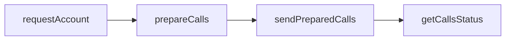

This guide outlines exactly what you need to use Wallet Server with your app! We'll go over the [`wallet_requestAccount`](https://www.alchemy.com/docs/node/smart-wallets/wallets-api-endpoints/wallets-api-endpoints/wallet-request-account), [`wallet_prepareCalls`](https://www.alchemy.com/docs/node/smart-wallets/wallets-api-endpoints/wallets-api-endpoints/wallet-prepare-calls), and [`wallet_sendPreparedCalls`](https://www.alchemy.com/docs/node/smart-wallets/wallets-api-endpoints/wallets-api-endpoints/wallet-send-prepared-calls) endpoints in this tutorial. _(Note: If you are wanting to use EIP-7702, see [this guide](/docs/reference/wallet-apis-7702-quickstart) instead.)_

The logical flow is to get an account for a given signer, prepare the calls you're looking to send, and send them! We'll demonstrate how to do it [using the SDK client](#using-the-typescript-sdk) or by using platform-agnostic [JSON-RPC APIs](#using-the-json-rpc-apis-directly).

In API calls, it's as simple as:



This guide assumes you have an account you can sign with, like an [Alchemy Signer](https://www.alchemy.com/docs/wallets/signer/what-is-a-signer#alchemy-signer). You will also need an Alchemy API key and a [gas manager policy ID.](https://www.alchemy.com/docs/wallets/react/sponsor-gas)

<Tip title="Don't have an API key?" icon="star">
  Start using the Alchemy Wallets API today! [Get started for
  free](https://dashboard.alchemy.com/signup/?a=f8afc2202c)
</Tip>

<Tabs>
  <Tab title="Using The TypeScript SDK">
    ## Using The TypeScript SDK

    ### Install Prerequisities

    You're going to need `@account-kit/wallet-client`, `@account-kit/infra`, optionally `@aa-sdk/core` if you use a `LocalAccountSigner`, and optionally `viem` if you want to verify a signed message.

    <CodeGroup>
    ```shell npm
    npm install @account-kit/wallet-client @account-kit/infra @aa-sdk/core
    ```

    ```shell bun
    bun add @account-kit/wallet-client @account-kit/infra @aa-sdk/core
    ```

    ```shell yarn
    yarn add @account-kit/wallet-client @account-kit/infra @aa-sdk/core
    ```

    </CodeGroup>

    ### Create A Smart Account Client

    Given a signer (e.g. a `LocalAccountSigner` imported from `@aa-sdk/core` or an [Alchemy Signer](https://www.alchemy.com/docs/wallets/signer/what-is-a-signer#alchemy-signer)), all you need to do is follow a few simple steps to start sending user ops with Wallet APIs!

    ```ts
    import { createSmartWalletClient } from "@account-kit/wallet-client";
    import { alchemy, arbitrumSepolia } from "@account-kit/infra";
    import { LocalAccountSigner } from "@aa-sdk/core";

    const signer = LocalAccountSigner.privateKeyToAccountSigner(PRIVATE_KEY); // we use a private key signer as an example here

    const transport = alchemy({
      apiKey: ALCHEMY_API_KEY, // use your Alchemy app api key here!
    });

    const client = createSmartWalletClient({
      transport,
      chain: arbitrumSepolia, // use any chain imported from @account-kit/infra here!
      signer,
    });
    ```

    ### Request The Account

    A counterfactual address is the account address associated with the given signer-- but the account contract hasn't been deployed yet.

    ```ts
    const account = await client.requestAccount();

    // get the address
    const address = account.address;
    ```

    ### Sign A Message

    ```ts
    import { createPublicClient } from "viem";

    const message = "we are so back";

    const signature = await client.signMessage({ message });

    const publicClient = createPublicClient({
      chain: arbitrumSepolia,
      transport: transport,
    });

    const isValid = await publicClient.verifyMessage({
      address: account.address, // fetched from await client.requestAccount()
      message,
      signature,
    });
    ```

    ### Sign Typed Data

    ```ts
    // assuming you have a typedData variable
    const signature = await client.signTypedData({ typedData });

    const isValid = await publicClient.verifyTypedData({
      address: account.address, // fetched from await client.requestAccount()
      ...typedData,
      signature,
    });
    ```

    ### Send A UserOp

    ```ts
    import { zeroAddress } from "viem";

    const account = await client.requestAccount();

    const preparedCalls = await client.prepareCalls({
      calls: [{ to: zeroAddress, value: "0x0" }], // callData is optional in a "data" parameter
      from: account.address,
      // "capabilities" is a data structure that hold gas manager data (as seen below) or permission data
      capabilities: {
        paymasterService: {
          policyId: GAS_MANAGER_POLICY_ID, // put your gas manager policy ID here
        },
      },
    });

    // Sign the calls
    const signedCalls = await client.signPreparedCalls(preparedCalls);

    // Send the userOp
    const result = await client.sendPreparedCalls(signedCalls);

    // Check calls status.
    const status = await client.getCallsStatus(preparedCallIds[0]);
    ```

  </Tab>
  <Tab title="Using The JSON-RPC APIs Directly">
    ## Using The JSON-RPC APIs Directly

    ### 1. Request an Account for the Owner Signer

    Given an owner address, call `wallet_requestAccount` to return the smart account address for that owner. The [owner](https://accountkit.alchemy.com/concepts/smart-account-signer) address can be any signer (or public key) that has the ability to sign transactions.

    - If you want to use social sign up / log in, you can simply use the [SDK](https://accountkit.alchemy.com/react/getting-started) to authenticate user's and retrieve their signer address
    - If instead, you want to generate and control wallets with a custodied owner, you can generate any public private key pair (e.g. any EOA)

    This will return the account address associated with the given signer, as well as a uuid you could use to differentiate between accounts for the same signer in the future.

    ```bash
    curl --request POST \
        --url https://api.g.alchemy.com/v2/API_KEY \
        --header 'accept: application/json' \
        --header 'content-type: application/json' \
        --data '
    {
      "id": 1,
      "jsonrpc": "2.0",
      "method": "wallet_requestAccount",
      "params": [
        {
          "signerAddress": "0xOWNER_ADDRESS"
        }
      ]
    }
    '
    ```

    This will return the smart account address associated with the given signer:

    ```bash
    {
      "jsonrpc": "2.0",
      "id": 1,
      "result": {
        "accountAddress": "0xACCOUNT_ADDRESS",
        "id": "af638-a8..."
      }
    }
    ```

    ### 2. Prepare Calls

    Now that we have an account, it's time to prepare some calls!

    ```bash
    curl --request POST \
        --url https://api.g.alchemy.com/v2/API_KEY \
        --header 'accept: application/json' \
        --header 'content-type: application/json' \
        --data '
    {
      "id": 1,
      "jsonrpc": "2.0",
      "method": "wallet_prepareCalls",
      "params": [
        {
          "capabilities": {
            "paymasterService": {
                "policyId": GAS_MANAGER_POLICY_ID // put your gas manager policy ID here
            }
          },
          "calls": [
            {
              "to": "0x0000000000000000000000000000000000000000"
            }
          ],
          "from": "0xACCOUNT_ADDRESS",
          "chainId": "0xCHAIN_ID"
        }
      ]
    }
    '
    ```

    This will return the userop request (the `data` field) and a signature request, for example:

    ```bash
    type: "user-operation-v070",
    data: {...useropRequest},
    chainId: "0xCHAIN_ID"
    signatureRequest: {
      type: "personal_sign",
      data: {
        raw: HASH_TO_SIGN,
      }
    }
    ```

    ### 3. Sign the userop

    With the returned signature request, all you have to do is sign the userop hash returned in the `signatureRequest.data.raw` field from step 4.

    You'll sign this using the account owner (from step 1). If using Alchemy Signer, you can learn how to stamp the request on the frontend [here](https://docs.alchemy.com/reference/how-to-stamp-requests).

    Note that the `type` field in the `signatureRequest` indicates the signature type needed, in this case, we need to `personal_sign` the hash.

    ### 4. Send the Prepared Calls!

    With the signature from step 3 and the `useropRequest` from step 2, you're good to send the call!

    ```bash
    curl --request POST \
        --url https://api.g.alchemy.com/v2/API_KEY \
        --header 'accept: application/json' \
        --header 'content-type: application/json' \
        --data '
    {
      "id": 1,
      "jsonrpc": "2.0",
      "method": "wallet_sendPreparedCalls",
      "params": [
        {
          "type": "user-operation-v070",
          "data": {...useropRequest},
          "chainId": "0xCHAIN_ID", // E.g. "0x66eee" for Arbitrum Sepolia
          "signature": {
            "type": "secp256k1"
            "data": "0xUSEROP_SIGNATURE",
          }
        }
      ]
    }
    '
    ```

    This will return the array of prepared call IDs!

    ### 5. Check The Calls Status

    Now you can simply call `wallet_getCallsStatus` to check the status of the calls.

    ```bash
    curl --request POST \
        --url https://api.g.alchemy.com/v2/API_KEY \
        --header 'accept: application/json' \
        --header 'content-type: application/json' \
        --data '
    {
      "id": 1,
      "jsonrpc": "2.0",
      "method": "wallet_getCallsStatus",
      "params": [
        "0xPREPARED_CALL_ID"
      ]
    }
    '
    ```

    See [here](/docs/node/smart-wallets/wallet-api-endpoints/wallet-api-endpoints/wallet-get-calls-status) for all of the possible results.

  </Tab>
</Tabs>
