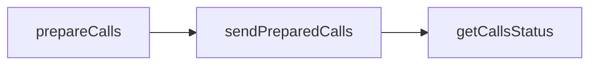

This short guide will introduce how to prepare and send user operations using a 7702 account in a matter of minutes. We'll demonstrate how to do it [using the SDK client](/reference/wallet-apis-7702-quickstart/sdk) or by using platform-agnostic [JSON-RPC APIs](/reference/wallet-apis-7702-quickstart/api).

<Info>
  [Learn more about what EIP-7702 is and when to use
  it.](/docs/wallets/react/using-7702)
</Info>

The logical flow is to prepare the your calls, sign them, and send them. In API calls, it's as simple as:

This guide assumes you have an account you can sign with, like an [Alchemy Signer](https://www.alchemy.com/docs/wallets/signer/what-is-a-signer#alchemy-signer) or a user's EOA. You will also need an Alchemy API key, and a [gas manager policy ID](https://www.alchemy.com/docs/wallets/react/sponsor-gas) if you want to sponsor gas.

<Tip title="Don't have an API key?" icon="star">
  Start using the Alchemy Wallets API today! [Get started for
  free](https://dashboard.alchemy.com/signup/?a=f8afc2202c).
</Tip>

<CardGroup cols={2}>
  <Card
    title="Using SDK"
    href="/reference/wallet-apis-7702-quickstart/sdk"
    icon="code"
  >
    Start building in minutes using the TypeScript SDK.
  </Card>
  <Card
    title="Using JSON-RPC API"
    href="/reference/wallet-apis-7702-quickstart/api"
    icon="network-wired"
  >
    Integrate with any RPC client using the JSON-RPC APIs.
  </Card>
</CardGroup>
