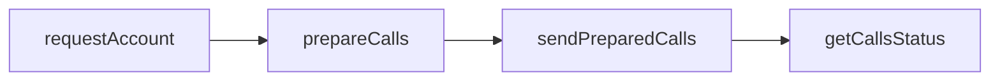

This guide outlines exactly what you need to use Wallet Server with your app! We'll go over the [`wallet_requestAccount`](https://www.alchemy.com/docs/node/smart-wallets/wallets-api-endpoints/wallets-api-endpoints/wallet-request-account), [`wallet_prepareCalls`](https://www.alchemy.com/docs/node/smart-wallets/wallets-api-endpoints/wallets-api-endpoints/wallet-prepare-calls), and [`wallet_sendPreparedCalls`](https://www.alchemy.com/docs/node/smart-wallets/wallets-api-endpoints/wallets-api-endpoints/wallet-send-prepared-calls) endpoints in this tutorial. _(Note: If you are wanting to use EIP-7702, see [this guide](/docs/reference/wallet-apis-7702-quickstart) instead.)_

The logical flow is to get an account for a given signer, prepare the calls you're looking to send, and send them! We'll demonstrate how to do it [using the SDK client](/reference/smart-wallet-quickstart/sdk) or by using platform-agnostic [JSON-RPC APIs](/reference/smart-wallet-quickstart/api).

In API calls, it's as simple as:

This guide assumes you have an account you can sign with, like an [Alchemy Signer](https://www.alchemy.com/docs/wallets/signer/what-is-a-signer#alchemy-signer). You will also need an Alchemy API key and a [gas manager policy ID.](https://www.alchemy.com/docs/wallets/react/sponsor-gas)

<Tip title="Don't have an API key?" icon="star">
  Start using the Alchemy Wallets API today! [Get started for
  free](https://dashboard.alchemy.com/signup/?a=f8afc2202c)
</Tip>

<CardGroup cols={2}>
  <Card
    title="Using SDK"
    href="/reference/smart-wallet-quickstart/sdk"
    icon="code"
  >
    Start building in minutes using the TypeScript SDK.
  </Card>
  <Card
    title="Using JSON-RPC API"
    href="/reference/smart-wallet-quickstart/api"
    icon="network-wired"
  >
    Integrate with any RPC client using the JSON-RPC APIs.
  </Card>
</CardGroup>
