- Table of Contents

# Overview

This document provides a comprehensive tracking map for migrating all exports from the v4 packages to the v5, along with tracking which changes are breaking.

# Context

This section contains diagrams for v4 package layout, v5 layout, and v4 to v5 mappings.

## V4 Architecture

Based on Adam’s diagram ([link](https://alchemyinsights.slack.com/archives/C094T1JRHDH/p1752681749733719)). Mainly moving to mermaid/markdown for usage with AI tools.

### V4 Connection Descriptions

| From                            | To                              | Description                                                                                                                    |
| ------------------------------- | ------------------------------- | ------------------------------------------------------------------------------------------------------------------------------ |
| **account-kit/plugingen**       | **account-kit/smart-contracts** | Defines a CLI for creating typescript bindings of BlocksafeAccountV1 plugins using the account definition from smart-contracts |
| **account-kit/smart-contracts** | **aa-sdk/core**                 | Defines smart contract account-specific encoding logic for Alchemy accounts using primitives from core                         |
| **account-kit/smart-contracts** | **account-kit/infra**           | Relies on transport and middleware definitions for interop from infra                                                          |
| **account-kit/infra**           | **aa-sdk/core**                 | Uses Alchemy APIs exposed as middleware and clients from core                                                                  |
| **aa-sdk/ethers**               | **aa-sdk/core**                 | Builds an adapter to ethers.js on top of core                                                                                  |
| **account-kit/signer**          | **aa-sdk/core**                 | Defines an Alchemy Signer React Native client compatible with the signer interface from core                                   |
| **account-kit/signer**          | **aa-sdk/core**                 | Defines an Alchemy Signer web app client compatible with the signer interface from core                                        |
| **account-kit/core**            | **account-kit/smart-contracts** | Uses Alchemy smart contract accounts defined in smart-contracts                                                                |
| **account-kit/core**            | **account-kit/infra**           | Consumes app state defined in infra                                                                                            |
| **account-kit/react**           | **account-kit/core**            | Exports similar React hooks to core                                                                                            |
| **account-kit/react**           | **wagmi**                       | Builds a state management system inspired by wagmi                                                                             |
| **wagmi**                       | **viem**                        | Builds react hooks and state management on top of viem                                                                         |
| **account-kit/infra**           | **wagmi**                       | Re-exports a copy of wagmi                                                                                                     |
| **aa-sdk/core**                 | **viem**                        | Builds custom support for account abstraction on top of viem                                                                   |

## V5 Architecture

## V4 to V5 Package Mappings

```mermaid
graph LR
    subgraph "v4 Packages"
        V4_PLUGINGEN["account-kit/plugingen"]
        V4_SMART_CONTRACTS["account-kit/smart-contracts"]
        V4_CORE_SDK["aa-sdk/core"]
        V4_ETHERS["aa-sdk/ethers"]
        V4_INFRA["account-kit/infra"]
        V4_WALLET_CLIENT["account-kit/wallet-client"]
        V4_SIGNER["account-kit/signer"]
        V4_CORE["account-kit/core"]
        V4_REACT["account-kit/react"]
        V4_RN["account-kit/react-native"]
        V4_RN_SIGNER["account-kit/react-native-signer"]
        V4_LOGGING["account-kit/logging"]
    end

    subgraph "v5 Packages"
        V5_COMMON["@alchemy/common"]
        V5_WALLET_APIS["@alchemy/wallet-apis"]
        V5_SIGNER["@alchemy/signer"]
        V5_SIGNER_WEB["@alchemy/signer-web"]
        V5_SIGNER_RN["@alchemy/signer-rn"]
        V5_SMART_ACCOUNTS["@alchemy/smart-accounts"]
        V5_WAGMI_CORE["@alchemy/wagmi-core"]
        V5_REACT["@alchemy/react"]
        V5_RN["@alchemy/react-native"]
        V5_REMOVED["❌ REMOVED"]
    end

    %% Direct mappings
    V4_SMART_CONTRACTS --> V5_SMART_ACCOUNTS
    V4_REACT --> V5_REACT
    V4_RN --> V5_RN
    V4_CORE --> V5_WAGMI_CORE

    %% Signer split mappings
    V4_SIGNER -.-> V5_SIGNER
    V4_SIGNER -.-> V5_SIGNER_WEB
    V4_RN_SIGNER --> V5_SIGNER_RN

    %% Merged mappings
    V4_INFRA --> V5_WALLET_APIS
    V4_WALLET_CLIENT --> V5_WALLET_APIS
    V4_CORE_SDK -.-> V5_WALLET_APIS

    %% Partial migrations
    V4_LOGGING --> V5_COMMON
    V4_INFRA -.-> V5_COMMON

    %% Removed packages
    V4_ETHERS --> V5_REMOVED
    V4_PLUGINGEN --> V5_REMOVED

    classDef v4 fill:#ffe6e6,stroke:#cc0000,stroke-width:2px,color:#000000
    classDef v5 fill:#e6ffe6,stroke:#00cc00,stroke-width:2px,color:#000000
    classDef removed fill:#cccccc,stroke:#666666,stroke-width:2px,color:#000000,stroke-dasharray: 5 5

    class V4_PLUGINGEN,V4_SMART_CONTRACTS,V4_CORE_SDK,V4_ETHERS,V4_INFRA,V4_WALLET_CLIENT,V4_SIGNER,V4_CORE,V4_REACT,V4_RN,V4_RN_SIGNER,V4_LOGGING v4
    class V5_COMMON,V5_WALLET_APIS,V5_SIGNER,V5_SIGNER_WEB,V5_SIGNER_RN,V5_SMART_ACCOUNTS,V5_WAGMI_CORE,V5_REACT,V5_RN,V5_RN_SIGNER v5
    class V5_REMOVED removed
```

# Package migrations, per export

This section tracks each package’s exports and their final migration status.

## Migration Status Legend

- **NO CHANGE**: API surface is unchanged going from V4 to V5
- **RENAMED/REDESIGNED**: Export name has changed, or underlying interface/signature is modified (breaking change)
- **TBD**: Need to discuss to finalize API design
- **DEPRECATED**: Will be removed/not migrated

## @account-kit/infra

Moves to:

- `@alchemy/common`: RPC clients, transport, chain management, error codes ([Design doc](https://www.notion.so/alchemy-common-V5-SDK-232069f20066804db642c949c46af6e8?pvs=21))
- `@alchemy/wallet-apis`: smart accounts, middleware, simulation, gas management ([Design doc](https://www.notion.so/Txn-Engine-Low-level-SDK-v5-Project-231069f200668021bda2e576a5f4c5e0?pvs=21))

### Transport & Connection (3 exports)

V4 transport implements sophisticated method routing with 46 Alchemy-specific RPC methods automatically routed to Alchemy infrastructure, with fallback to external RPC for unsupported operations.

| V4 Export            | V5 Destination    | Migration Status | Notes                                                            |
| -------------------- | ----------------- | ---------------- | ---------------------------------------------------------------- |
| `alchemy`            | `@alchemy/common` | **MIGRATE**      | Core transport factory with intelligent method routing preserved |
| `AlchemyTransport`   | `@alchemy/common` | **MIGRATE**      | Interface extends viem Transport with auth and config            |
| `isAlchemyTransport` | `@alchemy/common` | **NO CHANGE**    | Type guard function                                              |

### Client Creation (3 exports)

V4 provides enhanced clients with automatic middleware integration, signer type detection, and Alchemy-specific optimizations.

| V4 Export                         | V5 Destination                                | Migration Status | Notes                                                            |
| --------------------------------- | --------------------------------------------- | ---------------- | ---------------------------------------------------------------- |
| `createAlchemyPublicRpcClient`    | `@alchemy/common` → `createRpcClient`         | **RENAMED**      | Simplified RPC client factory returning ClientWithAlchemyMethods |
| `createAlchemySmartAccountClient` | `@alchemy/wallet-apis` → `createWalletClient` | **TBD**          | Enhanced smart account client with ERC-5792 compliance           |
| `isAlchemySmartAccountClient`     | `@alchemy/wallet-apis`                        | **TBD**          | Type guard moves with enhanced client                            |

### Chain Management (47 exports → 2 utilities)

V4 exports 46+ pre-configured chains with Alchemy RPC endpoints. V5 deprecates ALL custom chains in favor of viem chain bridging utilities for cleaner integration.

| V4 Export                                                          | V5 Destination    | Migration Status | Notes                                           |
| ------------------------------------------------------------------ | ----------------- | ---------------- | ----------------------------------------------- |
| `defineAlchemyChain`                                               | **DEPRECATED**    | **DEPRECATED**   | Use viem's `defineChain()` + bridging utilities |
| `mainnet`, `sepolia`, `arbitrum`, `base`, `optimism`, `polygon`    | **DEPRECATED**    | **DEPRECATED**   | Use viem chains + `withAlchemyRpc(chain, auth)` |
| `arbitrumSepolia`, `baseSepolia`, `optimismSepolia`, `polygonAmoy` | **DEPRECATED**    | **DEPRECATED**   | All testnet chains deprecated                   |
| `worldChain`, `shape`, `unichain`, `soneium` (30+ more...)         | **DEPRECATED**    | **DEPRECATED**   | All emerging chains deprecated                  |
| **NEW**: `withAlchemyRpc(chain, auth)`                             | `@alchemy/common` | **NEW**          | Enhance any viem chain with Alchemy RPC         |
| **NEW**: `lookupChainRpc(chain, auth)`                             | `@alchemy/common` | **NEW**          | Get Alchemy RPC URL for viem chain              |

**🚨 TEAM DISCUSSION**: Chain bridging strategy - static registry vs dynamic lookup?
**Impact**: 95% reduction in chain exports (46 → 2), cleaner viem integration

### Smart Account Actions (2 exports)

| V4 Export                   | V5 Destination         | Migration Status | Notes                                                   |
| --------------------------- | ---------------------- | ---------------- | ------------------------------------------------------- |
| `alchemyActions`            | `@alchemy/wallet-apis` | **TBD**          | Smart account action decorators with simulation support |
| `alchemyEnhancedApiActions` | `@alchemy/wallet-apis` | **TBD**          | Enhanced API decorators for NFT, DeFi, notifications    |

### Middleware System (4 exports)

V4 middleware implements sophisticated gas sponsorship with ERC-7677 compliance, ERC-20 token support, and multi-strategy paymaster integration.

| V4 Export                                 | V5 Destination         | Migration Status | Notes                                                    |
| ----------------------------------------- | ---------------------- | ---------------- | -------------------------------------------------------- |
| `alchemyFeeEstimator`                     | `@alchemy/wallet-apis` | **TBD**          | Optimized fee calculation using Rundler integration      |
| `alchemyGasManagerMiddleware`             | `@alchemy/wallet-apis` | **TBD**          | Policy-based gas sponsorship with ERC-20 token support   |
| `alchemyGasAndPayMasterAndDataMiddleware` | `@alchemy/wallet-apis` | **TBD**          | Combined gas + paymaster middleware for simplified usage |
| `alchemyUserOperationSimulator`           | `@alchemy/wallet-apis` | **TBD**          | Pre-execution validation and asset change simulation     |

### Simulation (1 export)

| V4 Export                      | V5 Destination         | Migration Status | Notes                                                              |
| ------------------------------ | ---------------------- | ---------------- | ------------------------------------------------------------------ |
| `simulateUserOperationChanges` | `@alchemy/wallet-apis` | **TBD**          | Asset change prediction with multi-token support (ERC-20/721/1155) |

### Gas Management (3 exports)

V4 implements version-specific paymaster addresses (EntryPoint v0.6.0 vs v0.7.0) with chain-specific optimization and ERC-20 token payment support.

| V4 Export                           | V5 Destination         | Migration Status | Notes                                                        |
| ----------------------------------- | ---------------------- | ---------------- | ------------------------------------------------------------ |
| `getAlchemyPaymasterAddress`        | `@alchemy/wallet-apis` | **TBD**          | Version and chain-specific paymaster address resolution      |
| `getDefaultUserOperationFeeOptions` | `@alchemy/wallet-apis` | **TBD**          | Chain-optimized fee settings (Arbitrum/Optimism adjustments) |
| `PolicyToken`                       | `@alchemy/wallet-apis` | **TBD**          | ERC-20 token payment configuration with permit support       |

### Additional Middleware (DUPLICATE - removed section)

This export is already covered in the Middleware System section above.

### Header Utils (2 exports)

V4 implements automatic header management for SDK version tracking (`Alchemy-AA-Sdk-Version`), authentication (`Authorization: Bearer`), and analytics headers for all 46 Alchemy-specific RPC methods.

| V4 Export                     | V5 Destination    | Migration Status | Notes                                              |
| ----------------------------- | ----------------- | ---------------- | -------------------------------------------------- |
| `mutateRemoveTrackingHeaders` | `@alchemy/common` | **MIGRATE**      | Internal utility for header management and privacy |
| `headersUpdate`               | `@alchemy/common` | **MIGRATE**      | Header update utility for transport configuration  |

### Export Tracking

- **Original exports**: 64 (46 chains + 18 functions/values)
- **V5 exports**: ~8 utilities (87% reduction)
- **Primary destinations**: `@alchemy/common` (core infrastructure), `@alchemy/wallet-apis` (smart account features)
- **Key changes**: All custom chains deprecated, simplified client factories, hidden middleware internals

## @account-kit/logging

### Logger Creation (4 exports)

Moves to:

- `@alchemy/common`: Main export here is the logger along with the types ([Design doc](https://www.notion.so/alchemy-common-V5-SDK-232069f20066804db642c949c46af6e8?pvs=21))

| V4 Export       | V5 Destination           | Migration Status | Notes |
| --------------- | ------------------------ | ---------------- | ----- |
| `createLogger`  | `@alchemy/common/logger` | **TBD**          |       |
| `EventLogger`   | `@alchemy/common/logger` | **TBD**          |       |
| `LoggerContext` | `@alchemy/common/logger` | **TBD**          |       |
| `EventsSchema`  | `@alchemy/common/logger` | TBD              |       |

### Final Tracking

- Original exports: 4
- Final exports: 4

## @account-kit/wallet-client

## Client Creation (3 exports)

| V4 Export                 | V5 Destination         | Migration Status | Notes |
| ------------------------- | ---------------------- | ---------------- | ----- |
| `createSmartWalletClient` | `@alchemy/wallet-apis` | **TBD**          |       |
| `SmartWalletClient`       | `@alchemy/wallet-apis` | **TBD**          |       |
| `SmartWalletClientParams` | `@alchemy/wallet-apis` | **TBD**          |       |

## Core Actions (9 exports)

| V4 Export              | V5 Destination         | Migration Status | Notes |
| ---------------------- | ---------------------- | ---------------- | ----- |
| `requestAccount`       | `@alchemy/wallet-apis` | **TBD**          |       |
| `prepareCalls`         | `@alchemy/wallet-apis` | **TBD**          |       |
| `signSignatureRequest` | `@alchemy/wallet-apis` | **TBD**          |       |
| `signPreparedCalls`    | `@alchemy/wallet-apis` | **TBD**          |       |
| `getCallsStatus`       | `@alchemy/wallet-apis` | **TBD**          |       |
| `grantPermissions`     | `@alchemy/wallet-apis` | **TBD**          |       |
| `signMessage`          | `@alchemy/wallet-apis` | **TBD**          |       |
| `signTypedData`        | `@alchemy/wallet-apis` | **TBD**          |       |
| `listAccounts`         | `@alchemy/wallet-apis` | **TBD**          |       |

## RPC Schema (2 exports)

| V4 Export                   | V5 Destination         | Migration Status | Notes |
| --------------------------- | ---------------------- | ---------------- | ----- |
| `WalletServerRpcSchema`     | `@alchemy/wallet-apis` | **TBD**          |       |
| `WalletServerRpcSchemaType` | `@alchemy/wallet-apis` | **TBD**          |       |

## ABI Exports (8 exports)

| V4 Export                                   | V5 Destination         | Migration Status | Notes |
| ------------------------------------------- | ---------------------- | ---------------- | ----- |
| `LightAccountFactoryAbi_V1_0_1`             | `@alchemy/wallet-apis` | **TBD**          |       |
| `LightAccountFactoryAbi_V1_0_2`             | `@alchemy/wallet-apis` | **TBD**          |       |
| `LightAccountFactoryAbi_V1_1_0`             | `@alchemy/wallet-apis` | **TBD**          |       |
| `LightAccountFactoryAbi_V2_0_0`             | `@alchemy/wallet-apis` | **TBD**          |       |
| `ModularAccountFactoryAbi_V2_0_0`           | `@alchemy/wallet-apis` | **TBD**          |       |
| `MultiOwnerLightAccountFactoryAbi_V2_0_0`   | `@alchemy/wallet-apis` | **TBD**          |       |
| `MultiOwnerModularAccountFactoryAbi_V1_0_0` | `@alchemy/wallet-apis` | **TBD**          |       |
| `MultisigModularAccountFactoryAbi_V1_0_0`   | `@alchemy/wallet-apis` | **TBD**          |       |

### Export Tracking

- Original exports: 22 (3 client + 9 core + 2 RPC schema + 8 ABI)
- Final exports: TBD

## @account-kit/smart-contracts

Moves to:

- `@alchemy/smart-accounts`: Complete migration of all smart account implementations, client factories, and plugin system

## Light Account System (32 exports)

| V4 Export                                        | V5 Destination            | Migration Status | Notes |
| ------------------------------------------------ | ------------------------- | ---------------- | ----- |
| `createLightAccount`                             | `@alchemy/smart-accounts` | **TBD**          |       |
| `createMultiOwnerLightAccount`                   | `@alchemy/smart-accounts` | **TBD**          |       |
| `transferLightAccountOwnership`                  | `@alchemy/smart-accounts` | **TBD**          |       |
| `updateMultiOwnerLightAccountOwners`             | `@alchemy/smart-accounts` | **TBD**          |       |
| `createLightAccountAlchemyClient`                | `@alchemy/smart-accounts` | **TBD**          |       |
| `createLightAccountClient`                       | `@alchemy/smart-accounts` | **TBD**          |       |
| `createMultiOwnerLightAccountAlchemyClient`      | `@alchemy/smart-accounts` | **TBD**          |       |
| `createMultiOwnerLightAccountClient`             | `@alchemy/smart-accounts` | **TBD**          |       |
| `lightAccountClientActions`                      | `@alchemy/smart-accounts` | **TBD**          |       |
| `multiOwnerLightAccountClientActions`            | `@alchemy/smart-accounts` | **TBD**          |       |
| `predictLightAccountAddress`                     | `@alchemy/smart-accounts` | **TBD**          |       |
| `predictMultiOwnerLightAccountAddress`           | `@alchemy/smart-accounts` | **TBD**          |       |
| `AccountVersionRegistry`                         | `@alchemy/smart-accounts` | **TBD**          |       |
| `LightAccountUnsupported1271Factories`           | `@alchemy/smart-accounts` | **TBD**          |       |
| `LightAccountUnsupported1271Impls`               | `@alchemy/smart-accounts` | **TBD**          |       |
| `defaultLightAccountVersion`                     | `@alchemy/smart-accounts` | **TBD**          |       |
| `getDefaultLightAccountFactoryAddress`           | `@alchemy/smart-accounts` | **TBD**          |       |
| `getDefaultMultiOwnerLightAccountFactoryAddress` | `@alchemy/smart-accounts` | **TBD**          |       |
| `getLightAccountVersionForAccount`               | `@alchemy/smart-accounts` | **TBD**          |       |
| Plus 13 additional Light Account type exports    | `@alchemy/smart-accounts` | **TBD**          |       |

## MSCA (Modular Smart Contract Account) System (42 exports)

| V4 Export                                                | V5 Destination            | Migration Status | Notes |
| -------------------------------------------------------- | ------------------------- | ---------------- | ----- |
| `createMultiOwnerModularAccount`                         | `@alchemy/smart-accounts` | **TBD**          |       |
| `createMultisigModularAccount`                           | `@alchemy/smart-accounts` | **TBD**          |       |
| `createModularAccountAlchemyClient`                      | `@alchemy/smart-accounts` | **TBD**          |       |
| `createMultiOwnerModularAccountClient`                   | `@alchemy/smart-accounts` | **TBD**          |       |
| `createMultisigModularAccountClient`                     | `@alchemy/smart-accounts` | **TBD**          |       |
| `createMultisigAccountAlchemyClient`                     | `@alchemy/smart-accounts` | **TBD**          |       |
| `accountLoupeActions`                                    | `@alchemy/smart-accounts` | **TBD**          |       |
| `pluginManagerActions`                                   | `@alchemy/smart-accounts` | **TBD**          |       |
| `installPlugin`                                          | `@alchemy/smart-accounts` | **TBD**          |       |
| `standardExecutor`                                       | `@alchemy/smart-accounts` | **TBD**          |       |
| `MultiOwnerPlugin`                                       | `@alchemy/smart-accounts` | **TBD**          |       |
| `SessionKeyPlugin`                                       | `@alchemy/smart-accounts` | **TBD**          |       |
| `MultisigPlugin`                                         | `@alchemy/smart-accounts` | **TBD**          |       |
| `SessionKeySigner`                                       | `@alchemy/smart-accounts` | **TBD**          |       |
| `SessionKeyPermissionsBuilder`                           | `@alchemy/smart-accounts` | **TBD**          |       |
| `multiOwnerPluginActions`                                | `@alchemy/smart-accounts` | **TBD**          |       |
| `multisigPluginActions`                                  | `@alchemy/smart-accounts` | **TBD**          |       |
| `sessionKeyPluginActions`                                | `@alchemy/smart-accounts` | **TBD**          |       |
| `multisigSignatureMiddleware`                            | `@alchemy/smart-accounts` | **TBD**          |       |
| Plus 23 additional MSCA exports (ABIs, utilities, types) | `@alchemy/smart-accounts` | **TBD**          |       |

## MA v2 (Modular Account v2) System (7 exports)

| V4 Export                            | V5 Destination            | Migration Status | Notes |
| ------------------------------------ | ------------------------- | ---------------- | ----- |
| `createModularAccountV2`             | `@alchemy/smart-accounts` | **TBD**          |       |
| `createModularAccountV2Client`       | `@alchemy/smart-accounts` | **TBD**          |       |
| `getMAV2UpgradeToData`               | `@alchemy/smart-accounts` | **TBD**          |       |
| `predictModularAccountV2Address`     | `@alchemy/smart-accounts` | **TBD**          |       |
| Plus 3 additional MA v2 type exports | `@alchemy/smart-accounts` | **TBD**          |       |

## Plugin Configuration (3 exports)

| V4 Export                   | V5 Destination            | Migration Status | Notes |
| --------------------------- | ------------------------- | ---------------- | ----- |
| `MultiOwnerPluginGenConfig` | `@alchemy/smart-accounts` | **TBD**          |       |
| `SessionKeyPluginGenConfig` | `@alchemy/smart-accounts` | **TBD**          |       |
| `MultisigPluginGenConfig`   | `@alchemy/smart-accounts` | **TBD**          |       |

## MA v2 Experimental (50 exports)

| V4 Export                                                              | V5 Destination            | Migration Status | Notes |
| ---------------------------------------------------------------------- | ------------------------- | ---------------- | ----- |
| `nativeSMASigner`                                                      | `@alchemy/smart-accounts` | **TBD**          |       |
| `installValidationActions`                                             | `@alchemy/smart-accounts` | **TBD**          |       |
| `deferralActions`                                                      | `@alchemy/smart-accounts` | **TBD**          |       |
| `PermissionBuilder`                                                    | `@alchemy/smart-accounts` | **TBD**          |       |
| `AllowlistModule`                                                      | `@alchemy/smart-accounts` | **TBD**          |       |
| `NativeTokenLimitModule`                                               | `@alchemy/smart-accounts` | **TBD**          |       |
| `PaymasterGuardModule`                                                 | `@alchemy/smart-accounts` | **TBD**          |       |
| `SingleSignerValidationModule`                                         | `@alchemy/smart-accounts` | **TBD**          |       |
| `TimeRangeModule`                                                      | `@alchemy/smart-accounts` | **TBD**          |       |
| `WebAuthnValidationModule`                                             | `@alchemy/smart-accounts` | **TBD**          |       |
| Plus 40 additional MA v2 experimental exports (ABIs, utilities, types) | `@alchemy/smart-accounts` | **TBD**          |       |

### Export Tracking

- Original exports: 134 (32 Light Account + 42 MSCA + 7 MA v2 + 3 Plugin Config + 50 MA v2 Experimental)
- Final exports: TBD

## @account-kit/signer

Moves to:

- `@alchemy/signer`: Core signing interface - authenticated signer ready for cryptographic operations
- `@alchemy/signer-web`: Web authentication client - handles login tasks and returns a Signer
- `@alchemy/signer-rn`: React Native authentication client - platform-specific authentication methods

### V4 to V5 Architecture Migration (TBD Implementation)

**BREAKING CHANGES**: Complete architectural restructure from mixed authentication/signing interfaces to separated responsibilities.

**V5 New Architecture** (per PR #1804):

- `Signer`: Authenticated signer ready for cryptographic operations
- `AuthClient`: Handles login tasks and returns a `Signer`
- Granular authentication methods: `sendAuthEmail()`, `submitOtpCode()`, `getSigner()`
- No automatic session storage

| V4 Export Category                           | V5 Architecture                       | Migration Status | Notes                                           |
| -------------------------------------------- | ------------------------------------- | ---------------- | ----------------------------------------------- |
| `BaseAlchemySigner`, `AlchemyWebSigner`      | `AuthClient` in `@alchemy/signer-web` | **TBD**          | Mixed auth/signing → separated responsibilities |
| `BaseSignerClient`, `AlchemySignerWebClient` | `AuthClient` in `@alchemy/signer-web` | **TBD**          | Client restructure with granular methods        |
| `SolanaSigner`                               | `AuthClient` in `@alchemy/signer-web` | **TBD**          | Platform-specific authentication                |

### Session Management (2 exports → @alchemy/signer)

| V4 Export            | V5 Destination    | Migration Status | Notes                                      |
| -------------------- | ----------------- | ---------------- | ------------------------------------------ |
| `SessionManager`     | `@alchemy/signer` | **NO CHANGE**    | Session management functionality preserved |
| `DEFAULT_SESSION_MS` | `@alchemy/signer` | **NO CHANGE**    | Session timeout constants unchanged        |

### Error Classes (5 exports → @alchemy/signer)

All authentication error classes maintain exact same API:

| V4 Export               | V5 Destination    | Migration Status | Notes                                |
| ----------------------- | ----------------- | ---------------- | ------------------------------------ |
| `NotAuthenticatedError` | `@alchemy/signer` | **NO CHANGE**    | Authentication failure error         |
| `OAuthProvidersError`   | `@alchemy/signer` | **NO CHANGE**    | OAuth provider configuration error   |
| `MfaRequiredError`      | `@alchemy/signer` | **NO CHANGE**    | Multi-factor authentication required |
| `OauthCancelledError`   | `@alchemy/signer` | **NO CHANGE**    | User cancelled OAuth flow            |
| `OauthFailedError`      | `@alchemy/signer` | **NO CHANGE**    | OAuth authentication failed          |

### Authentication Status & Config (2 exports → @alchemy/signer)

| V4 Export                    | V5 Destination    | Migration Status | Notes                                              |
| ---------------------------- | ----------------- | ---------------- | -------------------------------------------------- |
| `AlchemySignerStatus`        | `@alchemy/signer` | **NO CHANGE**    | Status enumeration (INITIALIZING, CONNECTED, etc.) |
| `SessionManagerParamsSchema` | `@alchemy/signer` | **NO CHANGE**    | Zod schema for session configuration               |

### Type System (All types → @alchemy/signer)

**PRESERVED**: All TypeScript interfaces and type definitions maintain exact same structure:

| V4 Export Category          | V5 Destination    | Migration Status | Notes                                   |
| --------------------------- | ----------------- | ---------------- | --------------------------------------- |
| `AuthParams` types          | `@alchemy/signer` | **NO CHANGE**    | Authentication parameter interfaces     |
| `OauthProviderConfig` types | `@alchemy/signer` | **NO CHANGE**    | OAuth provider configuration types      |
| `User` type                 | `@alchemy/signer` | **NO CHANGE**    | User information interface              |
| `SessionConfig` type        | `@alchemy/signer` | **NO CHANGE**    | Session configuration interface         |
| `AlchemySignerEvents` types | `@alchemy/signer` | **NO CHANGE**    | Event system type definitions           |
| Client configuration types  | `@alchemy/signer` | **NO CHANGE**    | All client types from `client/types.ts` |

### New Public Utilities (3 exports → @alchemy/signer)

Previously internal utilities now publicly available:

| V4 Internal Utility    | V5 Destination    | Migration Status | Notes                                  |
| ---------------------- | ----------------- | ---------------- | -------------------------------------- |
| `base64UrlEncode`      | `@alchemy/signer` | **NEW EXPORT**   | Base64 URL encoding utility now public |
| `generateRandomBuffer` | `@alchemy/signer` | **NEW EXPORT**   | Cryptographic random buffer generation |
| `parseMfaError`        | `@alchemy/signer` | **NEW EXPORT**   | MFA error parsing utility              |

### Migration Impact

- **Architecture**: Complete restructure from mixed auth/signing to separated `Signer`/`AuthClient` pattern
- **Package Structure**: 1 package → 2 packages (`@alchemy/signer`, `@alchemy/signer-web`)
- **Authentication Flow**: Monolithic `authenticate()` → granular methods (`sendAuthEmail()`, `submitOtpCode()`, `getSigner()`)
- **Session Management**: Automatic session storage → manual session handling
- **Export Mapping**: TBD based on new architecture implementation

### Key V5 Improvements

1. **Separated Responsibilities**: Clear distinction between authentication (AuthClient) and signing (Signer)
2. **Platform Separation**: Web authentication moved to dedicated `@alchemy/signer-web` package
3. **Granular Control**: Step-by-step authentication methods enable custom UI flows
4. **No Session Lock-in**: Developers control session persistence strategy
5. **Consistent Architecture**: Aligns with broader v5 `@alchemy/*` naming conventions

## @account-kit/react-native-signer

Moves to:

- `@alchemy/signer-rn`: React Native authentication client with platform-specific authentication methods

### React Native Authentication Migration

**COMPLETE PACKAGE MIGRATION**: React Native signer functionality moves to dedicated `@alchemy/signer-rn` package.

**V5 New Architecture** (per PR #1804):

- `AuthClient`: Handles React Native-specific login tasks and returns a `Signer`
- Platform-specific authentication methods for mobile environments
- Native module integration for secure authentication flows

| V4 Export                  | V5 Destination                      | Migration Status | Notes                                    |
| -------------------------- | ----------------------------------- | ---------------- | ---------------------------------------- |
| `RNAlchemySignerSingleton` | `@alchemy/signer-rn` → `AuthClient` | **TBD**          | Restructured as AuthClient pattern       |
| `RNSignerClient`           | `@alchemy/signer-rn` → `AuthClient` | **TBD**          | Platform-specific authentication methods |
| `NativeTEKStamper`         | `@alchemy/signer-rn`                | **TBD**          | Native module integration                |
| React Native utilities     | `@alchemy/signer-rn`                | **TBD**          | Platform-specific encoding/parsing       |

### Migration Impact

- **Package Structure**: Complete migration from `@account-kit/react-native-signer` → `@alchemy/signer-rn`
- **Architecture**: Restructured to match V5 `Signer`/`AuthClient` pattern
- **Platform Focus**: Dedicated React Native authentication implementation
- **Export Mapping**: TBD based on new architecture implementation

## @aa-sdk/core

### Shared Infrastructure → @alchemy/common

Core utilities and types used across multiple packages:

| V4 Export                             | V5 Destination    | Migration Status | Notes                                        |
| ------------------------------------- | ----------------- | ---------------- | -------------------------------------------- |
| `BaseError`                           | `@alchemy/common` | **MIGRATE**      | Foundation error class with version tracking |
| `BigNumberish` / `BigNumberishSchema` | `@alchemy/common` | **MIGRATE**      | Shared numeric type utilities                |
| `ConnectionConfig`                    | `@alchemy/common` | **REDESIGNED**   | Simplified from complex V4 unions            |
| `split` (transport utility)           | `@alchemy/common` | **MIGRATE**      | Transport splitting utility                  |
| Zod validation utilities              | `@alchemy/common` | **MIGRATE**      | Schema validation patterns                   |

### User Operation Exports → Visibility Changes

**OUT OF SCOPE**: User operation visibility decisions are **TBD** as they involve packages outside @alchemy/common scope.

### Previously Public → Status TBD

| V4 Export                         | V5 Status | Reason                                       |
| --------------------------------- | --------- | -------------------------------------------- |
| `buildUserOperation`              | **TBD**   | Internal implementation detail (design TBD)  |
| `buildUserOperationFromTx`        | **TBD**   | Low-level building function (design TBD)     |
| `buildUserOperationFromTxs`       | **TBD**   | Internal batch building (design TBD)         |
| `UserOperationStruct`             | **TBD**   | Internal representation type (design TBD)    |
| `_initUserOperation`              | **TBD**   | Private helper function (design TBD)         |
| Raw bundler client methods        | **TBD**   | Abstracted by higher-level APIs (design TBD) |
| Middleware implementation details | **TBD**   | Internal middleware functions (design TBD)   |

### Remain Public → @alchemy/wallet-apis

| V4 Export                         | V5 Destination         | Migration Status | Notes                             |
| --------------------------------- | ---------------------- | ---------------- | --------------------------------- |
| `UserOperationCallData`           | `@alchemy/wallet-apis` | **TBD**          | Needed for call data construction |
| `BatchUserOperationCallData`      | `@alchemy/wallet-apis` | **TBD**          | Batch transaction support         |
| `sendUserOperation`               | `@alchemy/wallet-apis` | **TBD**          | High-level sending function       |
| `waitForUserOperationTransaction` | `@alchemy/wallet-apis` | **TBD**          | Transaction waiting utility       |
| `dropAndReplaceUserOperation`     | `@alchemy/wallet-apis` | **TBD**          | User-facing replacement function  |

### Smart Account Core → @alchemy/smart-accounts

Account abstraction interfaces and utilities:

| V4 Export                | V5 Destination            | Migration Status | Notes                    |
| ------------------------ | ------------------------- | ---------------- | ------------------------ |
| `SmartContractAccount`   | `@alchemy/smart-accounts` | **TBD**          | Core account interface   |
| `SmartAccountSigner`     | `@alchemy/smart-accounts` | **TBD**          | Signer interface         |
| `toSmartContractAccount` | `@alchemy/smart-accounts` | **TBD**          | Account creation utility |
| `getAccountAddress`      | `@alchemy/smart-accounts` | **TBD**          | Address resolution       |
| `LocalAccountSigner`     | `@alchemy/smart-accounts` | **TBD**          | Private key signer       |
| `WalletClientSigner`     | `@alchemy/smart-accounts` | **TBD**          | Wallet client adapter    |

### Client Infrastructure → @alchemy/wallet-apis

Client and bundler functionality:

| V4 Export                  | V5 Destination         | Migration Status | Notes                         |
| -------------------------- | ---------------------- | ---------------- | ----------------------------- |
| `BundlerClient`            | `@alchemy/wallet-apis` | **TBD**          | Bundler client interface      |
| `SmartAccountClient`       | `@alchemy/wallet-apis` | **TBD**          | Enhanced smart account client |
| `createBundlerClient`      | `@alchemy/wallet-apis` | **TBD**          | Bundler client factory        |
| `createSmartAccountClient` | `@alchemy/wallet-apis` | **TBD**          | Smart account client factory  |
| Client action decorators   | `@alchemy/wallet-apis` | **TBD**          | Action system extensions      |

### Entry Point Support → @alchemy/smart-accounts

Entry point functionality preserved:

| V4 Export                               | V5 Destination            | Migration Status | Notes                        |
| --------------------------------------- | ------------------------- | ---------------- | ---------------------------- | -------- |
| `EntryPointVersion`                     | `@alchemy/smart-accounts` | **TBD**          | Version enumeration ("0.6.0" | "0.7.0") |
| `entryPointRegistry`                    | `@alchemy/smart-accounts` | **TBD**          | Address registry             |
| `getEntryPoint`                         | `@alchemy/smart-accounts` | **TBD**          | Entry point resolution       |
| `defaultEntryPointVersion`              | `@alchemy/smart-accounts` | **TBD**          | Version defaulting           |
| `EntryPointAbi_v6` / `EntryPointAbi_v7` | `@alchemy/smart-accounts` | **TBD**          | Contract ABIs                |

### Error Types → Distributed by Domain

| V4 Export                   | V5 Destination            | Migration Status | Notes                  |
| --------------------------- | ------------------------- | ---------------- | ---------------------- |
| `AccountNotFoundError`      | `@alchemy/smart-accounts` | **TBD**          | Account-specific error |
| `InvalidUserOperationError` | `@alchemy/wallet-apis`    | **TBD**          | UO-specific error      |
| `ChainNotFoundError`        | `@alchemy/common`         | **MIGRATE**      | Chain resolution error |
| `InvalidRpcUrlError`        | `@alchemy/common`         | **MIGRATE**      | Connection error       |

### Migration Impact

- **@alchemy/common Scope**: Only exports to @alchemy/common have defined migration statuses
- **Other Packages**: Smart account and wallet API migrations remain **TBD** (out of scope)
- **Type System**: Core utilities consolidated in `@alchemy/common`
- **User Operation Visibility**: Many internal UO functions will be hidden (exact details TBD)
